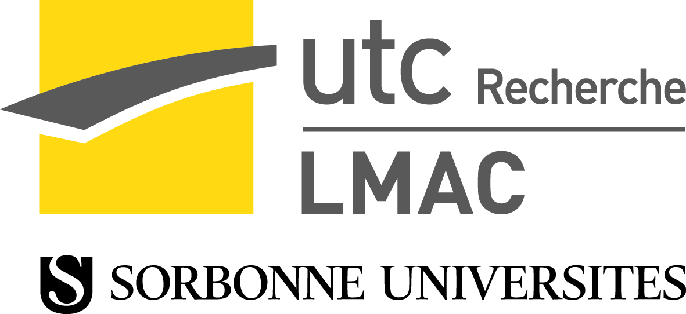

## Séminaire doctorants du LMAC

Chaque vendredi, entre 14 et 15h, est organisé le séminaire doctorants du LMAC, dans ses locaux.
C'est l'occasion déchanger sur ses thématiques de recherche, ainsi que de s'entraîner, pour l'orateur, à présenter ses travaux.

=======

## Welcome to GitHub Pages

Voici la page principale

A partir de cette page, on peut aller sur une autre par ce lien

[go to about](about)

[go to calendar](calendar)

[find out motivation here](motivation)
